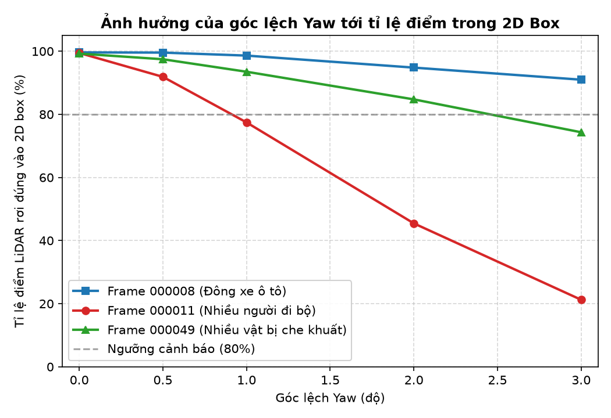
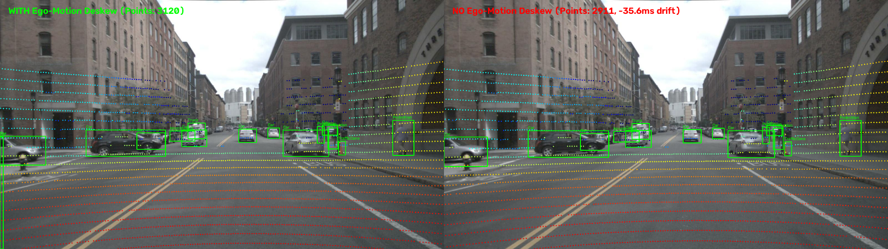

# Báo cáo Day 6: Độ nhạy của projection với lệch yaw

> Thay **mọi** ô có chữ ĐIỀN nằm trong ngoặc vuông bằng nội dung của bạn, xoá luôn cả dấu ngoặc vuông. Lệnh `python tools/check_submission.py` sẽ báo FAIL nếu còn sót bất kỳ chỗ nào.

- **Họ tên:** Bùi Văn Quang
- **MSSV:** 2A202602688
- **Lớp:** AI20K-T4
- **Link repo:** https://github.com/Quang20040/BuiVanQuang-2A202602688-Track4-Day21
- **Topic:** A — LiDAR-camera projection QA
- **Dataset:** data/kitti_mini
- **Các frame đã dùng:** 000008, 000011, 000049

> Hãy viết ngắn: mỗi mục từ 3 đến 8 dòng, ưu tiên số liệu và hình ảnh.

## 1. Claim

Lệch góc xoay yaw 1° làm tỉ lệ điểm LiDAR của người đi bộ (vật thể hẹp ở cự ly 15–30 m) rơi đúng vào 2D box giảm hơn 20 điểm phần trăm, trong khi đối với xe ô tô (vật thể rộng) chỉ giảm dưới 5 điểm phần trăm; hiện tượng calibration drift này có thể được định lượng và phát hiện thông qua bounding-box point alignment score.

## 2. Evidence

Kết quả quét góc lệch yaw từ 0.0° đến 3.0° trên 3 tình huống tiêu biểu của `data/kitti_mini` (chi tiết tại `results/yaw_perturb_sweep.csv`):

| Mức lệch Yaw | Frame 000008 (Đông xe) | Frame 000011 (Nhiều người đi bộ) | Frame 000049 (Bị che khuất) | Nhận xét chi tiết |
|:---:|:---:|:---:|:---:|---|
| **0.0°** | 99.63% | 99.45% (Ped: 99.67%) | 99.25% | Baseline chuẩn của calibration gốc |
| **0.5°** | 99.57% | 91.88% (Ped: 85.67%) | 97.46% | Người đi bộ bắt đầu sụt giảm rõ |
| **1.0°** | 98.62% | 77.44% (Ped: 61.89%) | 93.50% | Frame 000011 giảm 22.01%, Ped giảm 37.78% |
| **2.0°** | 94.81% | 45.44% (Ped: 21.17%) | 84.74% | Hơn một nửa số điểm người đi bộ rơi ra ngoài |
| **3.0°** | 90.98% | 21.23% (Ped: 5.21%) | 74.32% | Hầu như mất dấu hoàn toàn người đi bộ |



- **Phân tích số liệu:** Lệch yaw 1.0° làm điểm LiDAR trượt ngang trên ảnh xấp xỉ $\Delta u \approx f \cdot \tan(1^\circ) \approx 721.5 \cdot 0.01745 \approx 12.6$ pixel. Với người đi bộ ở cự ly 15–30 m chỉ rộng khoảng 15–20 pixel trên ảnh, độ trượt 12.6 pixel khiến tỉ lệ điểm trong box của người đi bộ giảm sâu từ 99.67% xuống 61.89% (giảm > 37 điểm phần trăm). Trong khi đó, với ô tô con rộng 60–120 pixel, độ trượt này chỉ làm sụt giảm 1.01% ở frame 000008 (giữ 98.62%).
- **Ngưỡng phát hiện:** Nếu thiết lập ngưỡng cảnh báo sớm tại `hit_ratio < 80%`, hệ thống có thể phát hiện ngay lỗi lệch yaw từ 1.0° trở lên trên các frame có đối tượng hẹp (người đi bộ) mà không bị báo động giả ở trạng thái chuẩn (baseline > 99%).

## 3. Failure case



- **Trường hợp:** nuScenes, frame `scene-0103_010`, chiếu LiDAR lên camera trước khi tắt cơ chế bù chuyển động xe (`--ignore-ego-motion`).
- **Quan sát:** Số điểm chiếu lọt vào ảnh giảm từ 3120 điểm xuống 2911 điểm (mất 209 điểm, giảm 6.7%). Các điểm LiDAR trên thân xe phía trước và biển báo ở gần bị trượt lệch vị trí so với hình ảnh thực tế của camera.
- **Nguyên nhân:** Camera trước chụp sớm hơn LiDAR 35.6 ms. Khi xe di chuyển với tốc độ đô thị 36 km/h (10 m/s), trong 35.6 ms xe đã di chuyển được một quãng đường $\Delta d \approx 0.36$ m. Nếu không dùng ego pose để bù chuyển động này (deskew), toạ độ các điểm LiDAR ở gần sẽ bị lệch lớn trên ảnh.
- **Lớp debug:** **Time (Thời gian & Đồng bộ cảm biến)**.
- **Cách phát hiện khi chạy thật:** Theo dõi độ chênh lệch timestamp giữa các cảm biến ($\Delta t = |t_{\text{cam}} - t_{\text{lidar}}|$). Cảnh báo nếu $\Delta t > 10$ ms mà xe đang di chuyển với vận tốc $v > 5$ km/h mà không có module deskew bằng IMU/Odom hoạt động.

*(Tham khảo thêm: [fail_02_yaw_2deg_pedestrian.png](../results/figures/fail_02_yaw_2deg_pedestrian.png) minh hoạ lỗi lớp **Geometry** khi lệch yaw 2.0° làm 78.8% điểm của người đi bộ trượt khỏi 2D box).*

## 4. Khuyến nghị nếu triển khai thật

Use-case cụ thể (ADAS / robot / drone), trade-off và bước tiếp theo.

[ĐIỀN]

## 5. Cách chạy lại

Các lệnh tái tạo lại toàn bộ kết quả từ repo sạch:

```bash
# 1. Tự kiểm tra 2 hàm velo_to_cam và cam_to_image
python -m src.test_projection

# 2. Tạo ảnh demo baseline overlay trên KITTI mini (frame 000011, 000008, 000049)
python -m starter.projection --data-root data/kitti_mini --frame 000011
python -m starter.projection --data-root data/kitti_mini --frame 000008
python -m starter.projection --data-root data/kitti_mini --frame 000049

# 3. Chạy demo trên dữ liệu synthetic và nuScenes
python -m starter.projection --data-root data/synthetic --frame 000000
python -m starter.projection --data-root data/nuscenes_mini_subset --frame scene-0103_010

# 4. Chạy thí nghiệm quét góc lệch yaw (CP3 benchmark)
python -m src.exp_yaw_sweep --data-root data/kitti_mini --frames 000008 000011 000049

# 5. Vẽ biểu đồ phân tích thí nghiệm yaw sweep
python -m src.plot_yaw_sweep

# 6. Tạo ảnh phân tích các failure cases (CP4)
python -m src.generate_failure_cases
```

## 6. Khai báo sử dụng AI

Ghi rõ đã dùng công cụ AI nào, dùng vào việc gì, và bạn đã tự kiểm chứng kết quả đó bằng cách nào. Nếu không dùng AI, ghi "Không sử dụng". Xem quy định ở `RULES.md` mục 2.

| Công cụ | Dùng cho việc gì | Bạn đã kiểm chứng thế nào |
|---|---|---|
| [ĐIỀN] | | |
